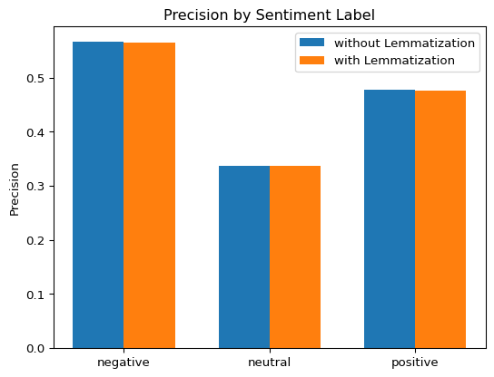
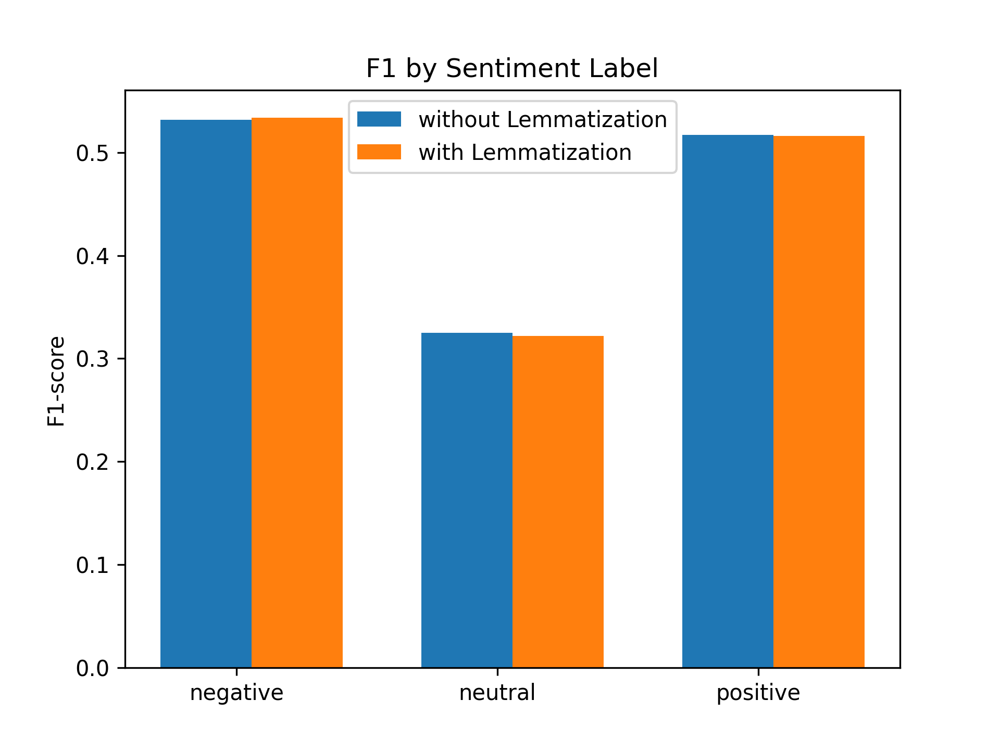

# Welcome to my NLP Project of Topic Modelling and Sentiment Analysis! 📈🙋‍♂️
## This is how I gained my interest in NLP

##### Currently have done: 
1. Sentiment Analysis of Tweets: *Does he/she sound happy and vibrant, neutral and calm, or angry and emotional?* 
Determine if the sentiment of a Tweet is Positive 😄, Neutral 😎, or negative 😠

##### Currently working on: 
1. Topic Modelling of Restaurant, Film and Literature Review - determine whether a review is about a Restaurant🍜, a Book📖 or a Film🎥
(Fixing some bugs at the moment🐞)

# About the models
### Topic Modelling:
- ###### Models:
1. BERT:
2. roBERTa:
###### Libraries used: 
###### Dataset:
###### Parameters:

######  Results:
(Charts or Tables)
###### Unsolved Issues:
1. 

### Sentiment Analysis:
###### Models:
1. **VADER (Valence Aware Dictionary and Sentiment Reasoner):** A pre-trained lexicon and rule-based sentiment analysis tool specifically designed for social media. Able to cope with complex texts and emoji.
###### Libraries used: *pandas,csv,sklearn,matplotlib,nltk,vader,spacy*
###### Datasets:
1. A Training Dataset of over 70000 Tweets, with original text and a human-evaluated sentiment label (Golden Label)
2. A Test Dataset of over 1500 Tweets, with original text and a human-evaluated sentiment label (Golden Label)
> Because VADER is pre-trained, only training dataset is used for direct prediction.
###### Parameters: 
  - Lemmatize: Whether the model predicts on the lemmas of words in a text, or the word itself
  - PoS(Part of Speech): Whether the model takes the entire text into account, or only a certain type of words

###### Results:
##### VADER Prediction without Lemmatizations (number of Tweets, 10281 in total):
|        | VADER Negative | VADER Neutral | VADER Positive |
|--------|--------------------|-------------------|--------------------|
| **Human Negative** | 1883 | 931 | 943 |
| **Human Neutral**  | 888 | 960  | 1205 |
| **Human Positive**| 555 | 956 | 1960  |

|           | Precision | Recall | F1-score | Support |
|-----------|-----------|--------|----------|---------|
| **Negative**  |   0.566   | 0.501  |  0.532   |  3757   |
| **Neutral**  |   0.337   | 0.314  |  0.325   |  3053   |
| **Positive**  |   0.477   | 0.565  |  0.517   |  3471   |
| **Accuracy**  |           |        |          |  0.467  |
| **Macro avg** |   0.460   | 0.460  |  0.458   | 10281   |
| **Weighted avg** | 0.468   | 0.467  |  0.466   | 10281   |

##### VADER Prediction with Lemmatizations (number of Tweets, 10281 in total):
|                  | VADER Negative | VADER Neutral | VADER Positive |
|------------------|----------------|---------------|----------------|
| **Human Negative** |       1901     |      909      |       947      |
| **Human Neutral**  |       897      |      943      |      1213      |
| **Human Positive** |       567      |      947      |      1957      |

|           | Precision | Recall | F1-score | Support |
|-----------|-----------|--------|----------|---------|
| **Negative**  |   0.565   | 0.506  |  0.534   |  3757   |
| **Neutral**   |   0.337   | 0.309  |  0.322   |  3053   |
| **Positive**  |   0.475   | 0.564  |  0.516   |  3471   |
| **Accuracy**  |           |        |          |  0.467  |
| **Macro avg** |   0.459   | 0.460  |  0.457   | 10281   |
| **Weighted avg** | 0.467   | 0.467  |  0.465   | 10281   |

| Precision                | Recall                 |
|--------------------------|-------------------------|
| | |

# Future Work:
1. Improve Accuracy: Consider crucial PoS
2. 
